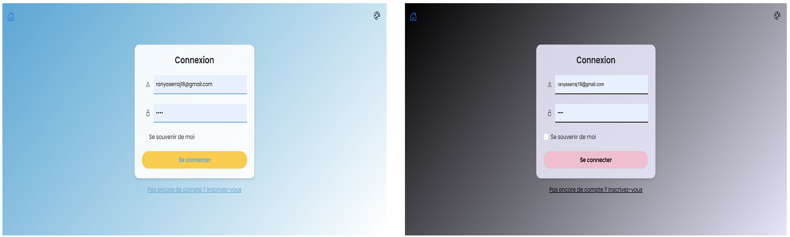
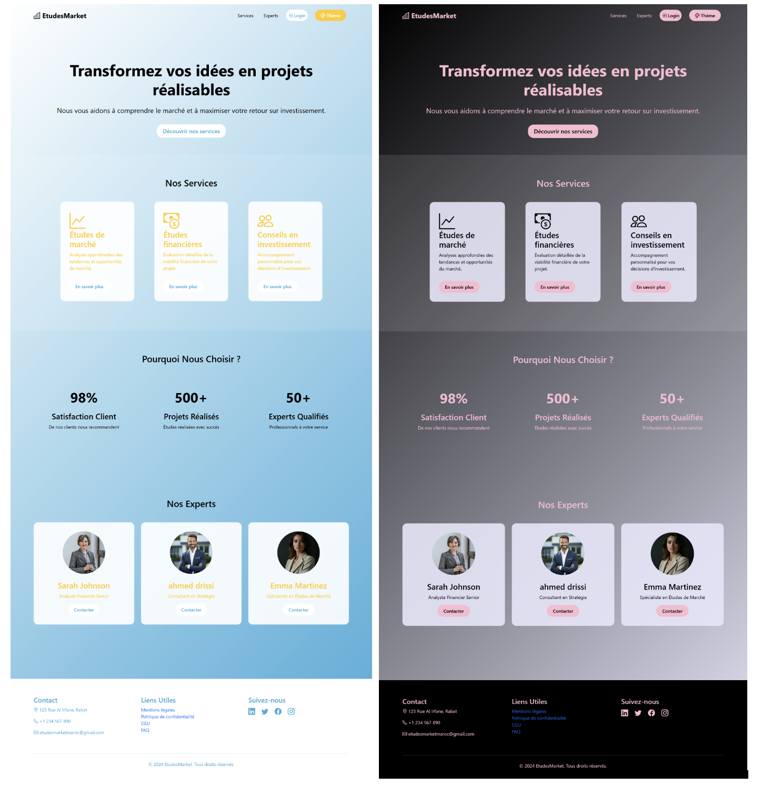
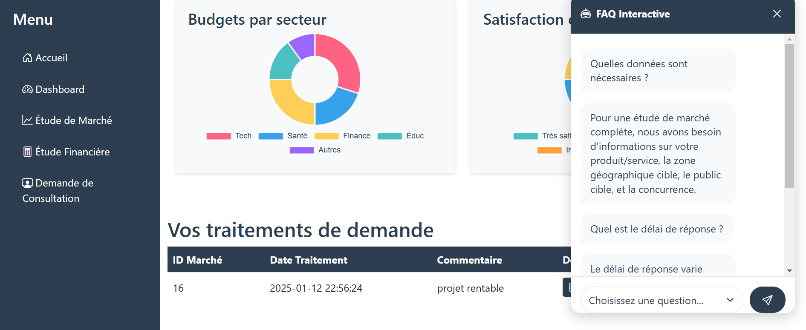
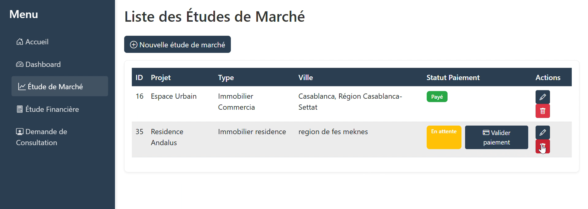
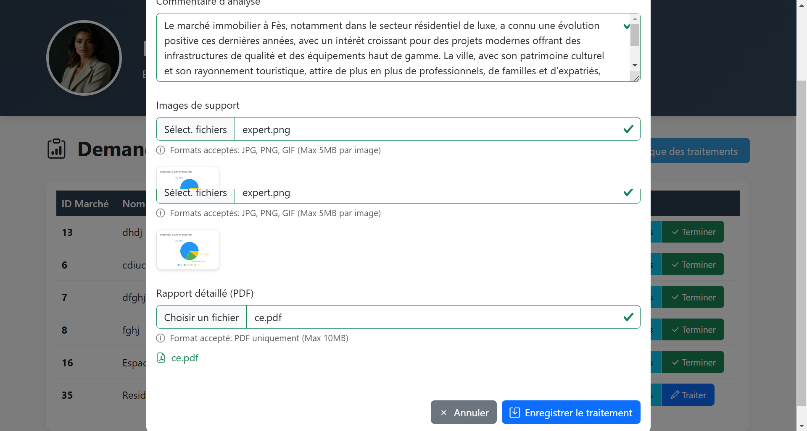

# UrbanInvest 🏢

Plateforme numérique dédiée aux investissements urbains et immobiliers.

## 🎯 Objectif

Faciliter la mise en relation entre investisseurs et experts pour l'évaluation de projets d'investissement.

## ⚡ Problématique

- Accès limité aux experts qualifiés
- Complexité d'analyse des projets
- Communication inefficace entre porteurs de projets et investisseurs

## 🚀 Fonctionnalités

### 📊 Types d'Études
- **Études de marché** - Analyses détaillées du marché local
- **Études financières** - Prévisions et analyse des risques
- **Études de faisabilité** - Évaluation complète des projets

### 💳 Gestion des Paiements
- Validation des preuves de paiement
- Traçabilité complète des transactions
- Sécurisation des échanges

### 📧 Notifications
- Alertes automatiques par email
- Suivi en temps réel des projets

## 📱 Aperçu de l'Application

### Page de Connexion

*Interface de connexion sécurisée pour investisseurs et experts*

### Page d'Accueil - Thème Clair et Sombre

*Interface principale avec les 3 services : Études de marché, Études financières, Conseils en investissement*


### Dashboard avec Analytics

*Tableau de bord avec graphiques : budgets par secteur, satisfaction clients, et suivi des traitements*

### Gestion des Études de Marché

*Liste des études avec statuts de paiement et actions (Espace Urbain, Résidence Andalus)*

### Interface Expert - Traitement

*Interface pour les experts : upload de rapports, images de support, et validation des traitements*

### Services Proposés
- **Études de marché** - Analyse approfondie des marchés financiers
- **Études financières** - Évaluation détaillée de la situation financière  
- **Conseils en investissement** - Accompagnement personnalisé par nos experts

### Équipe d'Experts
L'application présente une équipe qualifiée : Sarah Johnson (Analyste Finance), Ahmed Driss (Consultant), Emma Martinez (Spécialiste Études de Marché)

## 🛠️ Technologies

**Backend**
- Java 2EE
- Apache Tomcat

**Frontend**
- JSP (JavaServer Pages)
- HTML/CSS/JavaScript

**Base de Données**
- MySQL
- phpMyAdmin
- XAMPP

## 📋 Installation

### Prérequis
- Java JDK 8+
- Apache Tomcat 9.0+
- MySQL 5.7+
- XAMPP

### Setup
```bash
# 1. Démarrer XAMPP (Apache + MySQL)
# 2. Importer la base de données
mysql -u root -p projet3 < sql/UrbanInvest.sql

# 3. Déployer sur Tomcat
# Copier le fichier WAR dans webapps/

# 4. Démarrer Tomcat
```

## 🗃️ Base de Données

**Tables principales :**
- `users` - Comptes utilisateurs
- `demande_conseil` - Demandes d'investissement
- `etude_marche` - Études de marché
- `traitement_conseil` - Rapports experts
- `paiement` - Validation paiements

## 👥 Utilisateurs

**Investisseurs**
- Soumission de demandes
- Suivi des projets
- Réception de rapports

**Experts**
- Traitement des demandes
- Génération de rapports
- Validation des paiements

## 🚀 Démarrage Rapide

1. Cloner le projet
2. Configurer XAMPP
3. Importer la base de données
4. Déployer sur Tomcat
5. Accéder à `http://localhost:8080/UrbanInvest`

---

**UrbanInvest** - Investissements urbains professionnels
👩‍💻 Auteur
Ranya SERRAJ ANDALOUSSI 
📧 ranyaserraj18@gmail.com | 🔗 LinkedIn
